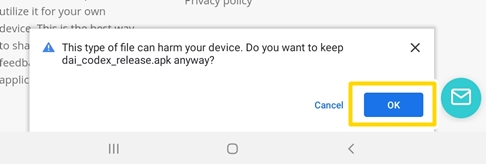
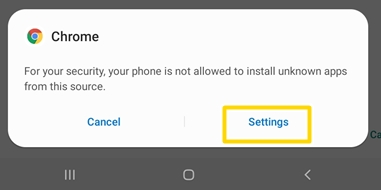
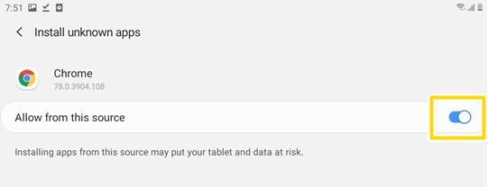
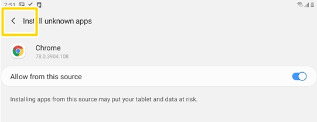

# Dragon Age Inqusition Codex Mobile App 🥚
**Table of Contents**
- [Demo](#Demo)
- [Installation](#Installation)
- [Features](#Features)
- [Possible Future Features](#Possible-Future-Features)
- [Keeping up to date](#Keeping-up-to-date)

## Demo

[Video Demo](https://www.youtube.com/watch?v=G1P6coVNMHk)

[Image Gallery](https://imgur.com/a/trRVLnz)

## Installation
🛑🛑🛑 **ONLY AVAILABLE FOR ANDROID DEVICES** 🛑🛑🛑

1. Download the `.apk` through the link below

> You have to be on your Android Device

[Download Link](https://github.com/leechuyem/DAI-Codex/releases/download/v1.0/dai_codex_app_v1.apk)

2. Tap `Ok` to the popup that asks "Do you want to keep it anyway?"

3. After the download, there may be another popup that asks you to change some settings. Tap on `Settings`

4. Enable `Allow from this source`

5. Tap `back`

6. Install and open the app!

## Features
🐣 View main codex entries

🐣 Grid tarot view

🐣 Grid tarot view with text

🐣 List tarot view

🐣 "Crafting Materials" codex

## Possible Future Features

🥚 Ability to add custom Inqusitor's name for each race

🥚 Ability to add custom Hawke's name

🥚 Ability to add custom Hero of Fereldon's anme for each race

🥚 Ability to choose pronounce or add custom pronounce

🥚 Ability to save favourite codex

🥚 Ability to search for codex by keywords

🥚 Distinct view for iPad/Tablets

## Keeping up to date

I post updates of the app over on my twitter.

Also, if you have found any issues/bugs with the app, feel free to contact me over there (:

[Twitter](https://twitter.com/spaacegf)
